Activity Graphs
================
Morgan Ferrans
10/28/2021

## \# MEAN DEVIANCE GRAPHS

#### INDIVIDUAL GRAPHS FOR 1 INDIVIDUAL PUPPY FOR 1 INDIVIDUAL WEEK

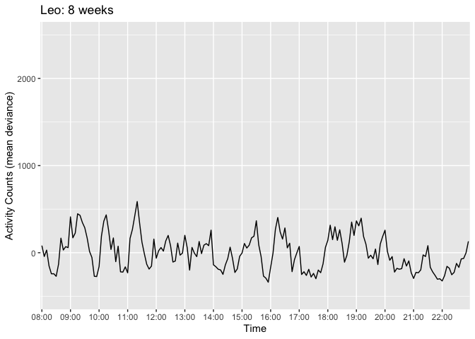<!-- -->

#### GRAPH OF MEAN DEVIANCE (GROUPED BY PUPPY) FOR 1 SPECIFIC WEEK

<!-- -->

#### COMPARE TWO PUPPIES’ MEAN DEVIANCE FOR 1 SPECIFIC WEEK

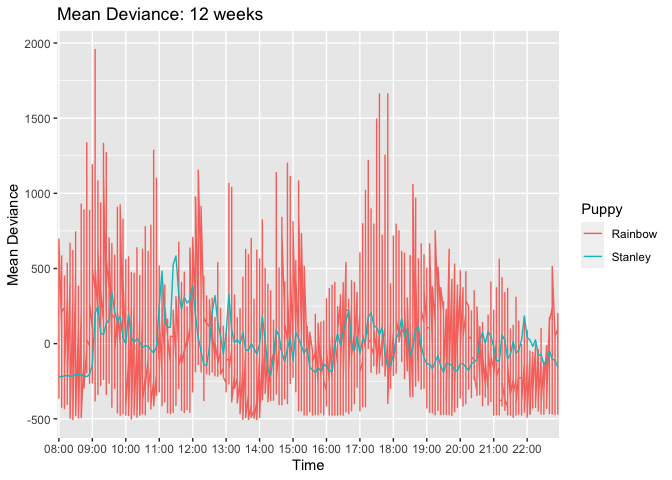<!-- -->

#### GROUP AVG FOR 1 INDIVIDUAL WEEK

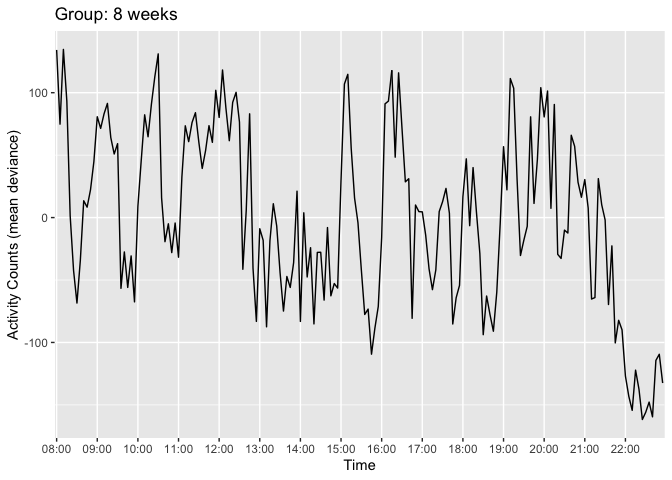<!-- -->

#### GRAPHS OF ALL WEEKS OVERLAID (USING ENTIRE GROUP MEAN DEVIANCE)

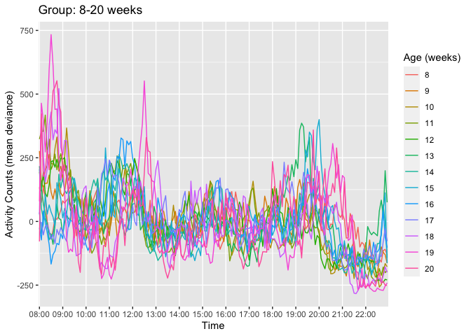<!-- -->
\#\#\#\# GRAPHS OF ALL WEEKS FOR 1 INDIVIDUAL PUPPY
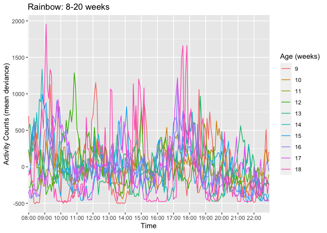<!-- -->

#### GRAPHS OF GROUP DEVIANCE: 8 VS 20 WEEKS

<!-- -->

#### GRAPHS OF GROUP DEVIANCE: 8, 14, & 20 WEEKS

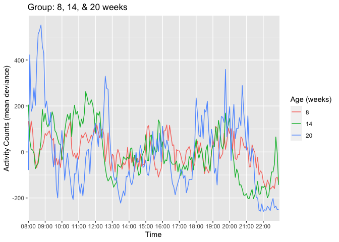<!-- -->

## \# MEAN ACTIVITY COUNT GRAPHS (raw mean activity, not deviance)

#### INDIVIDUAL GRAPH OF RAW (MEAN) ACTIVITY COUNTS FOR 1 INDIVIDUAL PUPPY FOR 1 INDIVIDUAL WEEK

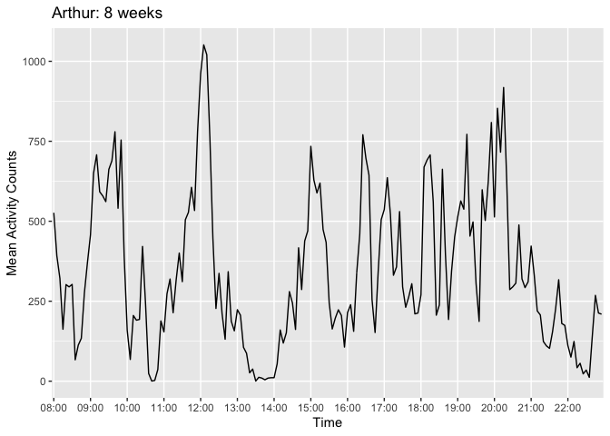<!-- -->

#### GRAPH OF RAW (MEAN) ACTIVITY COUNTS GROUPED BY PUPPY) FOR 1 SPECIFIC WEEK

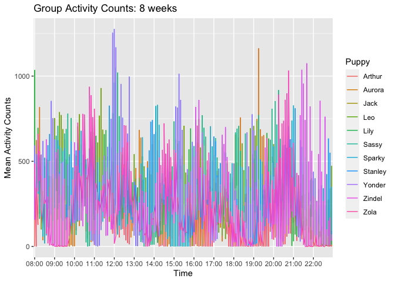<!-- -->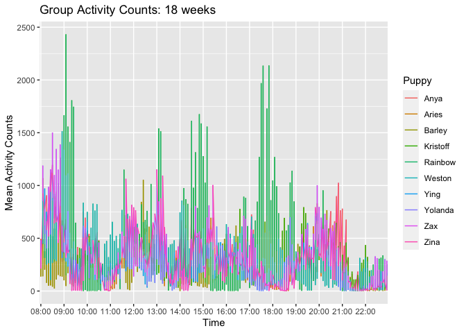<!-- -->

#### COMPARE TWO PUPPIES’ RAW MEAN ACTIVITY COUNTS FOR 1 SPECIFIC WEEK

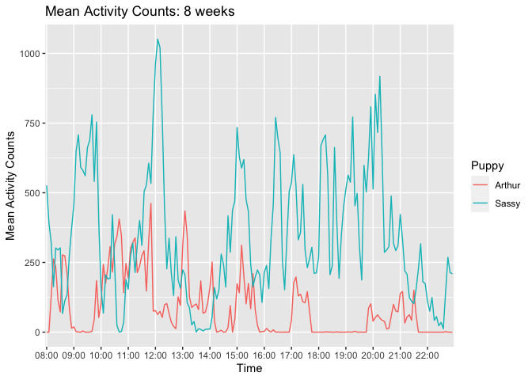<!-- -->

#### GROUP AVG OF RAW (MEAN) ACTIVITY COUNTS FOR 1 INDIVIDUAL WEEK

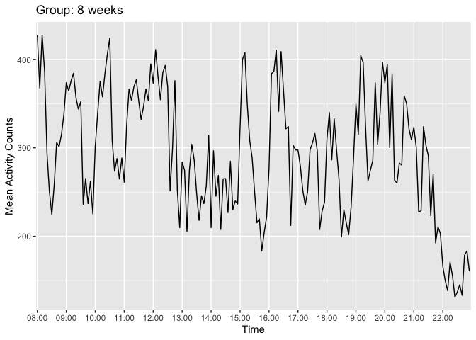<!-- -->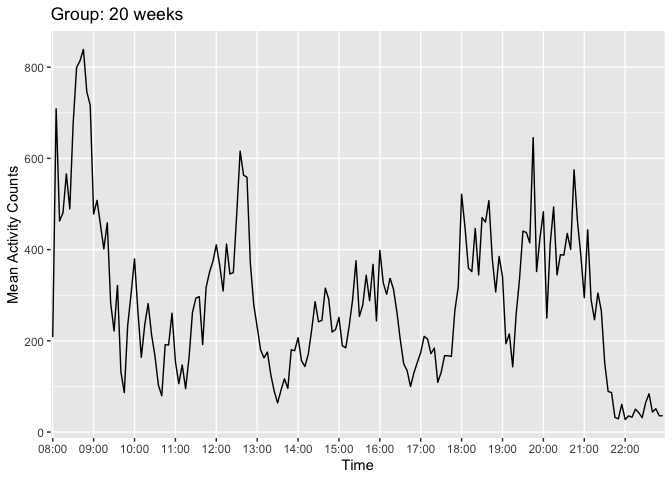<!-- -->

#### GRAPHS OF ALL WEEKS OVERLAID (USING ENTIRE GROUP RAW MEAN ACTIVITY COUNTS)

<!-- -->

#### GRAPHS OF GROUP: 8 VS 20 WEEKS (RAW MEAN ACTIVITY COUNTS)

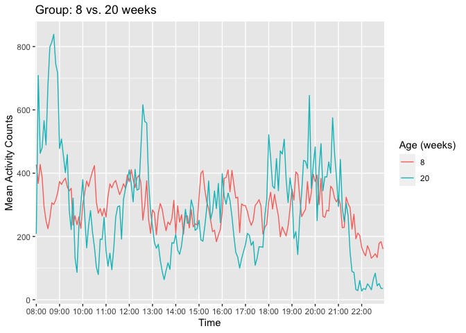<!-- -->

#### GRAPHS OF GROUP: 8, 14, & 20 WEEKS

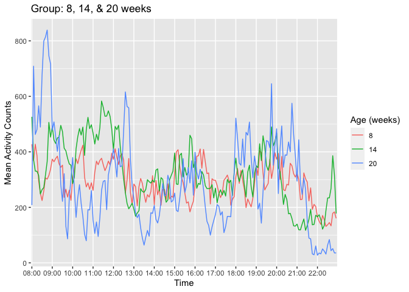<!-- -->
