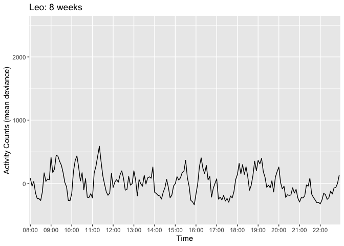
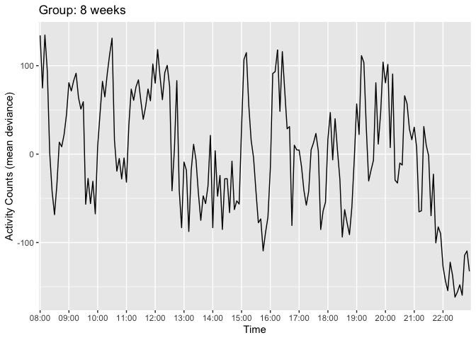
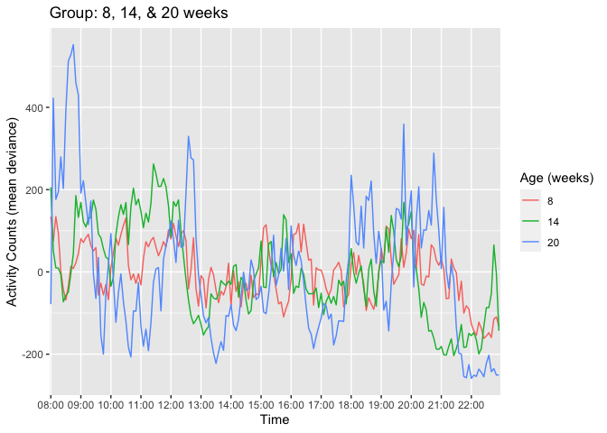
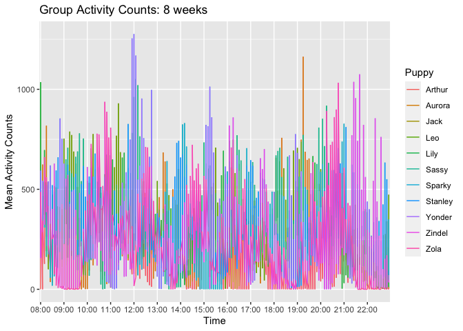
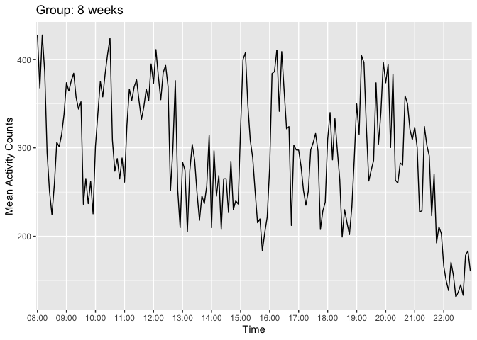
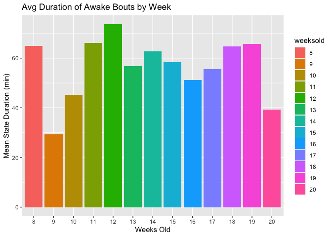

ACTIVITY MONITOR DATA (Updated 20211026)

``` r
knitr::opts_chunk$set(echo = FALSE)
```

## \#DATA SETUP

Load packages and import data

    ## ── Attaching packages ─────────────────────────────────────── tidyverse 1.3.1 ──

    ## ✓ ggplot2 3.3.5     ✓ purrr   0.3.4
    ## ✓ tibble  3.1.4     ✓ dplyr   1.0.7
    ## ✓ tidyr   1.1.3     ✓ stringr 1.4.0
    ## ✓ readr   2.0.1     ✓ forcats 0.5.1

    ## ── Conflicts ────────────────────────────────────────── tidyverse_conflicts() ──
    ## x dplyr::filter() masks stats::filter()
    ## x dplyr::lag()    masks stats::lag()

    ## 
    ## Attaching package: 'lubridate'

    ## The following object is masked from 'package:clock':
    ## 
    ##     as_date

    ## The following objects are masked from 'package:base':
    ## 
    ##     date, intersect, setdiff, union

    ## 
    ## Attaching package: 'hms'

    ## The following object is masked from 'package:lubridate':
    ## 
    ##     hms

Removing dates where collar is off

Rename columns

Delete sleeping hours (10pm-8am)

Adding DOB, weeks old, rearing (home vs DPK), & sex columns

Make hour column

Make combined column for date and time

Create 5 minute intervals labels

For each puppy, find an average of activity for each 5 minute interval
(make one mean activity count for each interval)

    ## `summarise()` has grouped output by 'intervaltime', 'weeksold', 'name', 'rearing'. You can override using the `.groups` argument.

    ## `summarise()` has grouped output by 'intervaltime', 'Date', 'weeksold', 'name', 'rearing'. You can override using the `.groups` argument.

Deviance from weekly means (for each puppy) for each (5 min interval)
data point (creates indiv\_weekly\_dev df)

    ## `summarise()` has grouped output by 'name'. You can override using the `.groups` argument.

Find an average of activity for each week for each 5 minute interval
(make one mean activity count for each interval) (not by puppy, for the
entire group)

    ## `summarise()` has grouped output by 'intervaltime'. You can override using the `.groups` argument.

| \#PLOTTING ACTIVITY Setup                                      |
|----------------------------------------------------------------|
| Store weeks old as a factor                                    |
| List of desired hourly time breaks for graph x axis tick marks |
| \#MEAN DEVIANCE GRAPHS                                         |

INDIVIDUAL GRAPHS FOR 1 INDIVIDUAL PUPPY FOR 1 INDIVIDUAL WEEK
<!-- --> GRAPH OF MEAN
DEVIANCE (GROUPED BY PUPPY) FOR 1 SPECIFIC WEEK
<!-- --> COMPARE TWO
PUPPIES’ MEAN DEVIANCE FOR 1 SPECIFIC WEEK
<!-- --> GROUP AVG FOR
1 INDIVIDUAL WEEK
<!-- --> GRAPHS OF ALL
WEEKS OVERLAID (USING ENTIRE GROUP MEAN DEVIANCE)
<!-- --> GRAPHS OF ALL
WEEKS FOR 1 INDIVIDUAL PUPPY
<!-- -->

GRAPHS OF GROUP DEVIANCE: 8 VS 20 WEEKS
<!-- --> GRAPHS OF
GROUP DEVIANCE: 8, 14, & 20 WEEKS
<!-- -->

## \#MEAN ACTIVITY COUNT GRAPHS (raw mean activity, not deviance)

INDIVIDUAL GRAPH OF RAW (MEAN) ACTIVITY COUNTS FOR 1 INDIVIDUAL PUPPY
FOR 1 INDIVIDUAL WEEK
<!-- --> GRAPH OF RAW
(MEAN) ACTIVITY COUNTS GROUPED BY PUPPY) FOR 1 SPECIFIC WEEK
<!-- --><!-- -->
COMPARE TWO PUPPIES’ RAW MEAN ACTIVITY COUNTS FOR 1 SPECIFIC WEEK
<!-- --> GROUP AVG OF
RAW (MEAN) ACTIVITY COUNTS FOR 1 INDIVIDUAL WEEK
<!-- --><!-- -->
GRAPHS OF ALL WEEKS OVERLAID (USING ENTIRE GROUP RAW MEAN ACTIVITY
COUNTS) <!-- --> GRAPHS
OF GROUP: 8 VS 20 WEEKS (RAW MEAN ACTIVITY COUNTS)
<!-- --> GRAPHS OF
GROUP: 8, 14, & 20 WEEKS
<!-- -->

| \#CALCULATE SLEEP BOUTS                                                                                                                           |
|---------------------------------------------------------------------------------------------------------------------------------------------------|
| Rest/wake thresholds                                                                                                                              |
| Intervals of resting and wakefulness                                                                                                              |
| `## Note: method with signature 'Period#ANY' chosen for function '-', ##  target signature 'Period#Period'. ##  "ANY#Period" would also be valid` |
| `` ## `summarise()` has grouped output by 'name', 'weeksold'. You can override using the `.groups` argument. ``                                   |
| `` ## `summarise()` has grouped output by 'weeksold'. You can override using the `.groups` argument. ``                                           |
| Calculate rest/wake duration (avg and total) for each puppy for each week, add rearing & sex info                                                 |
| `` ## `summarise()` has grouped output by 'weeksold', 'name'. You can override using the `.groups` argument. `` Compare home vs. DPK pups         |
| `` ## `summarise()` has grouped output by 'weeksold', 'state'. You can override using the `.groups` argument. ``                                  |
| Without collapsing across days:                                                                                                                   |
| `` ## `summarise()` has grouped output by 'name', 'Date', 'weeksold'. You can override using the `.groups` argument. ``                           |
| `` ## `summarise()` has grouped output by 'weeksold', 'name', 'intervaltime'. You can override using the `.groups` argument. ``                   |
| `` ## `summarise()` has grouped output by 'weeksold', 'intervaltime'. You can override using the `.groups` argument. ``                           |
| `` ## `summarise()` has grouped output by 'weeksold'. You can override using the `.groups` argument. ``                                           |
| `` ## `summarise()` has grouped output by 'weeksold', 'name'. You can override using the `.groups` argument. ``                                   |

## \#PLOTTING REST/WAKE BOUTS

Compare average rest/wake bout durations in 1 individual week
<!-- --> Compare
average rest/awake bout durations for each week
<!-- --><!-- -->
Total Minutes of Rest by Week
<!-- --> AVG REST HOME
VS. DPK
<!-- --><!-- -->

## \#BY PUPPY

Bar graph: Mean State Duration for 1 puppy by weeks
<!-- --> Line graph:
Mean State Duration for 1 puppy by weeks
<!-- --> Line graph:
mean rest state duration by week for each puppy
<!-- -->

## \#EXPORT

EXPORT dfs individually

EXPORT dfs as sheets on one doc
