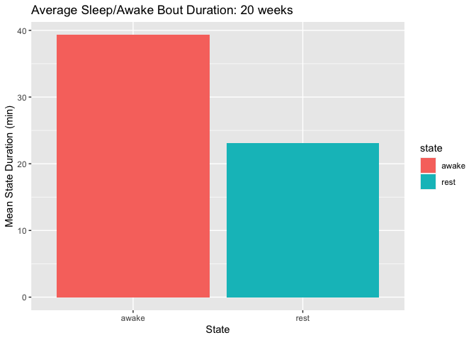
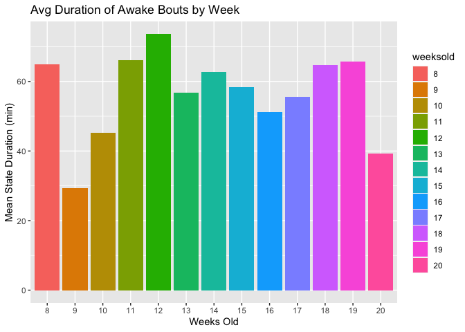
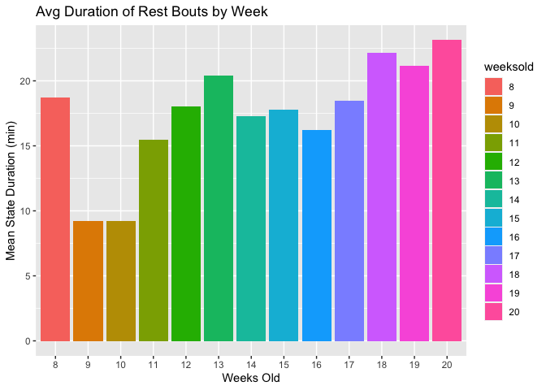
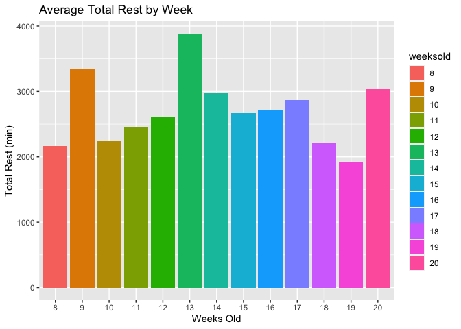
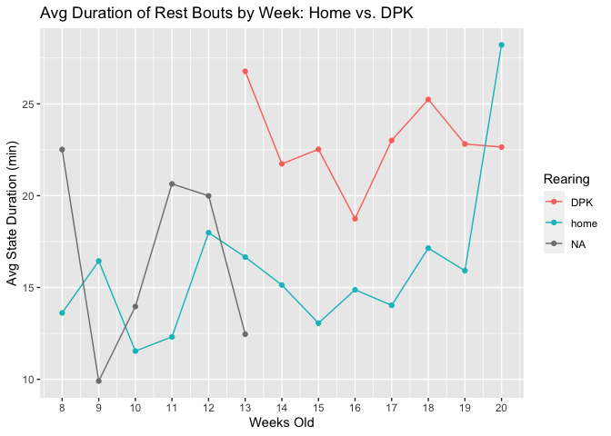
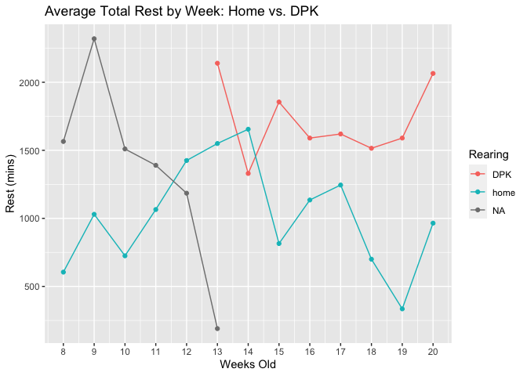
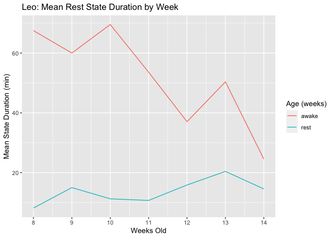
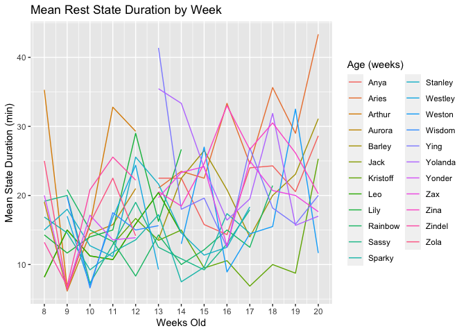

Sleep Data
================
Morgan Ferrans
10/28/2021

``` r
knitr::opts_chunk$set(echo = TRUE)
```

``` r
library(readxl)    
library(tidyverse)
```

    ## ── Attaching packages ─────────────────────────────────────── tidyverse 1.3.1 ──

    ## ✓ ggplot2 3.3.5     ✓ purrr   0.3.4
    ## ✓ tibble  3.1.4     ✓ dplyr   1.0.7
    ## ✓ tidyr   1.1.3     ✓ stringr 1.4.0
    ## ✓ readr   2.0.1     ✓ forcats 0.5.1

    ## ── Conflicts ────────────────────────────────────────── tidyverse_conflicts() ──
    ## x dplyr::filter() masks stats::filter()
    ## x dplyr::lag()    masks stats::lag()

``` r
library(dplyr)
library(clock)
library(lubridate)
```

    ## 
    ## Attaching package: 'lubridate'

    ## The following object is masked from 'package:clock':
    ## 
    ##     as_date

    ## The following objects are masked from 'package:base':
    ## 
    ##     date, intersect, setdiff, union

``` r
library(hms)
```

    ## 
    ## Attaching package: 'hms'

    ## The following object is masked from 'package:lubridate':
    ## 
    ##     hms

``` r
load(file = "activitygraphsenv.RData")
```

# DATA FRAMES

``` r
head(sleepbouts)
```

    ## # A tibble: 6 × 14
    ## # Groups:   name, weeksold [6]
    ##   name  weeksold intervaltime rearing sex   interval_avg_acti… weeklymeanforage…
    ##   <chr> <fct>    <chr>        <chr>   <chr>              <dbl>             <dbl>
    ## 1 Anya  13       08:00        DPK     F                   832               311.
    ## 2 Anya  14       08:00        DPK     F                   865.              350.
    ## 3 Anya  15       08:00        DPK     F                   650.              271.
    ## 4 Anya  16       08:00        DPK     F                   468.              311.
    ## 5 Anya  17       08:00        DPK     F                   587.              296.
    ## 6 Anya  18       08:00        DPK     F                   347.              357.
    ## # … with 7 more variables: N <int>, meandeviance <dbl>, state <chr>,
    ## #   intervalend <chr>, timeperiod <Period>, timeperiod_end <Period>,
    ## #   group <int>

``` r
head(sleepbouts2)
```

    ## # A tibble: 6 × 12
    ## # Groups:   name, weeksold [1]
    ##   intervaltime Date       weeksold name  rearing sex   interval_avg_activ… state
    ##   <chr>        <date>        <dbl> <chr> <chr>   <chr>               <dbl> <chr>
    ## 1 08:00        2019-10-02       13 Anya  DPK     F                    572  awake
    ## 2 08:05        2019-10-02       13 Anya  DPK     F                    761. awake
    ## 3 08:10        2019-10-02       13 Anya  DPK     F                   1093. awake
    ## 4 08:15        2019-10-02       13 Anya  DPK     F                    100. awake
    ## 5 08:20        2019-10-02       13 Anya  DPK     F                      0  rest 
    ## 6 08:25        2019-10-02       13 Anya  DPK     F                      0  rest 
    ## # … with 4 more variables: intervalend <chr>, timeperiod <Period>,
    ## #   timeperiod_end <Period>, group <int>

|                            |
|----------------------------|
| \#PLOTTING REST/WAKE BOUTS |

Compare average rest/wake bout durations in 1 individual week

``` r
ggplot(subset(sleepbout_weeklyavg,weeksold=="20"), aes(x=state, y=Mean_mins))+ geom_col(aes(fill=state)) + ggtitle("Average Sleep/Awake Bout Duration: 20 weeks") + xlab("State")+ ylab("Mean State Duration (min)") + labs(colour = "State")
```

<!-- --> Compare
average rest/awake bout durations for each week

``` r
ggplot(subset(sleepbout_weeklyavg,state=="awake"), aes(x=weeksold, y=Mean_mins))+ geom_col(aes(fill=weeksold)) + ggtitle("Avg Duration of Awake Bouts by Week") + xlab("Weeks Old")+ ylab("Mean State Duration (min)") + labs(colour = "Age (weeks)")
```

<!-- -->

``` r
ggplot(subset(sleepbout_weeklyavg,state=="rest"), aes(x=weeksold, y=Mean_mins))+ geom_col(aes(fill=weeksold)) + ggtitle("Avg Duration of Rest Bouts by Week") + xlab("Weeks Old")+ ylab("Mean State Duration (min)") + labs(colour = "Age (weeks)")
```

<!-- --> Total
Minutes of Rest by Week

``` r
ggplot(subset(sleepbout_weeklyavg,state=="rest"), aes(x=weeksold, y=Total_mins))+ geom_col(aes(fill=weeksold)) + ggtitle("Average Total Rest by Week") + xlab("Weeks Old")+ ylab("Total Rest (min)") + labs(colour = "Age (weeks)")
```

<!-- --> AVG REST
HOME VS. DPK

``` r
weeks<-c(8:20)

ggplot(subset(sleepbout_weeklyavg_rearing,state=="rest"), aes(x=weeksold, y=Mean_mins, colour=rearing, group=rearing)) + geom_point() + geom_line() + ggtitle("Avg Duration of Rest Bouts by Week: Home vs. DPK") + xlab("Weeks Old")+ ylab("Avg State Duration (min)") + labs(colour = "Rearing") + scale_x_continuous(breaks=weeks)
```

<!-- -->

``` r
ggplot(subset(sleepbout_weeklyavg_rearing,state=="rest"), aes(x=weeksold, y=Total_mins, colour=rearing, group=rearing)) + geom_point() + geom_line() + ggtitle("Average Total Rest by Week: Home vs. DPK") + xlab("Weeks Old")+ ylab("Rest (mins)") + labs(colour = "Rearing") + scale_x_continuous(breaks=weeks)
```

<!-- -->

## \#BY PUPPY

Bar graph: Mean State Duration for 1 puppy by weeks

``` r
ggplot(subset(sleepbout_weeklyavg_bypuppy, name=="Leo"), aes(x=weeksold, y=Mean_mins))+ geom_col(aes(fill=state)) + ggtitle("Leo: Mean Rest State Duration by Week") + xlab("Weeks Old")+ ylab("Mean State Duration (min)") + labs(colour = "Age (weeks)")+ scale_x_continuous(breaks=weeks)
```

<!-- --> Line
graph: Mean State Duration for 1 puppy by weeks

``` r
ggplot(subset(sleepbout_weeklyavg_bypuppy, name=="Leo"), aes(x=weeksold, y=Mean_mins, group=state))+ geom_line(aes(colour=state)) + ggtitle("Leo: Mean Rest State Duration by Week") + xlab("Weeks Old")+ ylab("Mean State Duration (min)") + labs(colour = "Age (weeks)")+ scale_x_continuous(breaks=weeks)
```

<!-- --> Line
graph: mean rest state duration by week for each puppy

``` r
ggplot(subset(sleepbout_weeklyavg_bypuppy, state=="rest"), aes(x=weeksold, y=Mean_mins, group=name))+ geom_line(aes(colour=name)) + ggtitle("Mean Rest State Duration by Week") + xlab("Weeks Old")+ ylab("Mean State Duration (min)") + labs(colour = "Age (weeks)")+ scale_x_continuous(breaks=weeks)
```

<!-- -->
